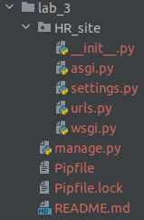
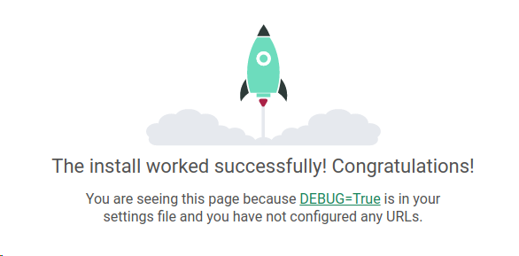
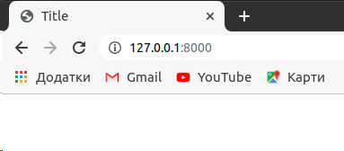
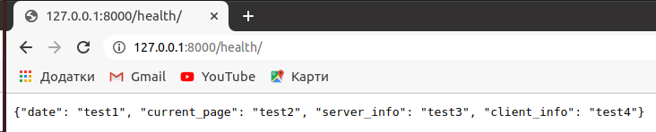

# Lab_3: Вступ до моніторингу.

****

## Хід роботи:
1. Створив папку з назвою лабораторної роботи у власному репозиторію. Перейшовши у папку ініціалізував середовище pipenv та встановив необхідні пакети командами pipenv `--python 3.8` та `pipenv install django`;
2. За допомогою Django Framework створив заготовку проекту. Для зручності виніс всі створені файли на один рівень вище:  
Заготовку створив командою:
```
pipenv run django-admin startproject HR_site
```
Файли переніс на рівень вище командами:  
```
mv HR_site/HR_site/* HR_site/
mv HR_site/manage.py ./
```
В результаті вийшла така структура проекту:  
  
3. Переконався, що все встановилось правильно і запустив Django сервер. Виконав команду `pipenv run python manage.py runserver` та перейшов за посиланням, яке вивелось у консолі;  
Результат:  
  
4. Все запустилось успішно і стартова сторінка Django відображається коректно, тому я зупинив сервер виконавши переривання Ctrl+C та створив коміт із базовим темплейтом сайту. 
5. Створив темплейт додатку (app) у якому буде описано всі web сторінки сайту. Створив коміт із новоствореними файлами темплейту додатка;
Для створення темплейту додатку виконав:  
```
pipenv run python manage.py startapp hr_main
```
6. Використовуючи можливості PyCharm створив папку hr_main/templates/, а також у даній папці файл з розширенням .html (hr_main.html). Також у папці додатку створив ще один файл hr_main/urls.py. Зробив коміт із даними файлами;
7. Вказав Django frameworks його назву та де шукати веб сторінки, у файлі `HR_site/settings.py` у змінній `INSTALLED_APPS`, також вніс зміни у файл `HR_site/urls.py` за зразком;
8. Далі перейшов до додатку: 
    1. Створив сторінки двох типів - перша буде зчитуватись з .html темплейта. друга сторінка буде просто повертати відповідь у форматі JSON;
    2. Відкрив та ознайомився із вмістом файла main/views.py;
9. Щоб поєднати функції із реальними URL шляхами за якими будуть доступні наші веб сторінки заповнив файл main/urls.py згідно зразка.
10. Запустив сервер та переконався, що сторінки доступні. Виконав коміт робочого Django сайту.  


11. Встановив бібліотеку `requests` командою `pipenv install requests` для подальшого моніторингу;
12. Відкрив сторінку /health у браузері і побачив що дані відобразились коректно, на екрані з'явилась json відповідь.
13. Для здачі/захисту лабораторної роблю:  
      1. Модифікую функцію health так щоб у відповіді були: згенерована на сервері дата, URL сторінки моніторингу, інформація про сервер на якому запущений сайт та інформація про клієнта який робить запит до сервера;   
    Модифікована функція:
      ```python
    def health(request):
        date = datetime.now()
        year = date.strftime("%Y")
        month = date.strftime("%B")
        day = date.strftime("%A")
        time = date.time().strftime("%H:%M:%S")
        sysname = os.name
        systype = os.sys.platform
        current_page = request.get_host() + request.get_full_path()
        response = {'date': {'year': year, 'month': month, 'day': day, 'time': time}, 'current_page': current_page, 'server_info': {"sysname": sysname, "systype": systype}, 'client_info': os.getlogin()}
        return JsonResponse(response)
      ```
      2. Дописую функціонал який буде виводити повідомлення про недоступність сайту у випадку якщо WEB сторінка недоступна;
      ```python
    def main(url):
        try:
            r = requests.get(url)
        except requests.exceptions.ConnectionError:
            logging.error("Сайт не доступний!")
        else:
            data = json.loads(r.content)
            logging.info(f"Сервер доступний. Дата на сервері: {data['date']['year']}.{data['date']['month']}.{data['date']['day']}. Час: {data['date']['time']}")
            logging.info("Запитувана сторінка: : %s", data['current_page'])
            logging.info("Відповідь сервера місти наступні поля:")
            for key in data.keys():
                if isinstance(data[key], dict):
                    result = ''
                    for i in data[key].keys():
                        result+=f"{i}:{data[key][i]}, "
                    logging.info(f"Ключ: {key}, Значення: {result}")
                else:
                    logging.info("Ключ: %s, Значення: %s", key, data[key])
      ```
    3. Після запуску моніторингу запит йде лише один раз після чого програма закінчується - роблю так щоб дана програма запускалась раз в хвилину та працювала в бекграунді;
    Роблю так щоб програма виконувалась раз в хвилину:  
    ```python
    if __name__ == '__main__':
        while(True):
            main("http://localhost:8000/health")
            time.sleep(60)
    ```
    Запускаю програму на фоні:
    ```
    pipenv run python3 monitoring.py &
    ```
    4. Спростив роботу з пайтон середовищем через швидкий виклик довгих команд. Зробив аліас на запуск моніторингу:
    ```
    [scripts]
    server = "python manage.py runserver 127.0.0.1:8000"
    monitoring = "python3 monitoring.py"
    ```
    Для запуску команди відповідно використовую:
    ```
    pipenv run monitoring
    ```
14. Запустив сервер та переконався що головна сторінка відображається. Перейшов у інше вікно консолі та запустив програму моніторингу. Закомітив файл логів server.logs до репозиторію.