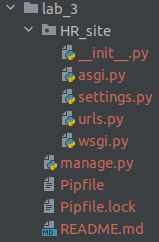
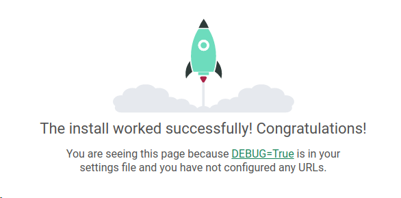

# Lab_3: Вступ до моніторингу.

****

## Хід роботи:
1. Створив папку з назвою лабораторної роботи у власному репозиторію. Перейшовши у папку ініціалізував середовище pipenv та встановив необхідні пакети командами pipenv `--python 3.8` та `pipenv install django`;
2. За допомогою Django Framework створив заготовку проекту. Для зручності виніс всі створені файли на один рівень вище:  
Заготовку створив командою:
```
pipenv run django-admin startproject HR_site
```
Файли переніс на рівень вище командами:  
```
mv HR_site/HR_site/* HR_site/
mv HR_site/manage.py ./
```
В результаті вийшла така структура проекту:  

3. Переконався, що все встановилось правильно і запустив Django сервер. Виконав команду `pipenv run python manage.py runserver` та перейшов за посиланням, яке вивелось у консолі;
Результат:

4. Все запустилось успішно і стартова сторінка Django відображається коректно, тому я зупинив сервер виконавши переривання Ctrl+C та створив коміт із базовим темплейтом сайту. 