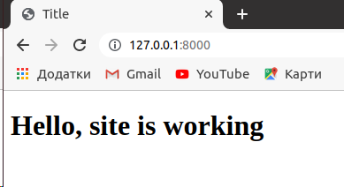
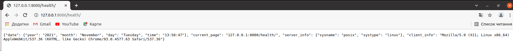

# Lab_4: Робота з Docker.

****

## Хід роботи:
1. Для ознайомлення з Docker'ом звернувся до [документації](https://docs.docker.com/);
2. Для перевірки чи докер встановлений і працює правильно на віртуальній машині запустив перевірку версії, виведення допомоги та тестовий імедж:
    ```
    docker -v
    docker -h
    docker run docker/whalesay cowsay Docker is fun
    ```
    - Перенаправив вивід цих команд у файл `my_work.log` та закомітив його.
3. Docker працює з Імеджами та Контейнерами. Ознайомився з [документацією](https://docs.docker.com/engine/reference/builder/)
4. Для знайомства з Docker створив імедж із Django сайтом зробленим у попередній роботі.
    - Оскільки мій проект на Python то і базовий імедж також вибираю відповідний. Всі імеджі можна знайти на [Python Docker Hub](https://hub.docker.com/_/python). Використаємо команду щоб завантажити базовий імедж з репозиторію:
    ```
    docker pull python:3.8.12-slim
    docker images
    REPOSITORY        TAG           IMAGE ID       CREATED       SIZE
    python            3.8.12-slim   214d62795dbb   6 days ago    122MB
    hello-world       latest        feb5d9fea6a5   5 weeks ago   13.3kB
    docker/whalesay   latest        6b362a9f73eb   6 years ago   247MB
    docker inspect python:3.8.12-slim
    ```
   - Створив файл з іменем Dockerfile скопіював туди вміст такого ж файлу з репозиторію викладача;
   - Ознайомився із коментарями та постарався зрозуміти структуру написання Dockerfile;
   - Замінив посилання на власний Git репозиторій із веб-сайтом та закомітив даний Dockerfile;
5. Створив власний репозиторій на Docker Hub під іменем `lab_4`;
6. Виконав білд (build) Docker імеджа та завантажив його до репозиторію. Для цього я вказав правильну назву репозиторію та TAG. Оскільки мій репозиторій `vladgrz/lab_4` то команда буде виглядати (де django - це тег):
   ```
   docker build -t vladgrz/lab_4:django .
   REPOSITORY        TAG           IMAGE ID       CREATED              SIZE
   vladgrz/lab_4     django        7ec209a1f156   About a minute ago   335MB
   python            3.8.12-slim   214d62795dbb   6 days ago           122MB
   hello-world       latest        feb5d9fea6a5   5 weeks ago          13.3kB
   docker/whalesay   latest        6b362a9f73eb   6 years ago          247MB
   docker push vladgrz/lab_4:django
   ```
   - Посилання на [Docker Hub репозиторій](https://hub.docker.com/repository/docker/vladgrz/lab_4/) та на [імедж](https://hub.docker.com/layers/vladgrz/lab_4/django/images/sha256-829f4bcbb4e9f24000f85efb1ab9191b9fe0079f084db8785d06b9223f2273f2?context=explore).
7. Для запуску веб-сайту виконав команду:
   ```
   docker run -it --name=django --rm -p 8000:8000 vladgrz/lab_4:django
   ```
   - Перейшов на адресу `http://127.0.0.1:8000` та переконався що веб-сайт працює  
   
   
8. Оскільки веб-сайт готовий і працює, створив ще один контейнер із програмою моніторингу веб-сайту:
   - Створив ще один Dockerfile(Dockerfile.monitor) в якому помістив програму моніторингу;
   - Виконав білд даного імеджа та дав йому тег `monitoring`:
   ```
   docker build -t vladgrz/lab_4 -f Dockerfile.monitor .
   docker tag vladgrz/lab_4 vladgrz/lab_4:monitoring
   docker push vladgrz/lab_4:monitoring
   ```
   - Запустив два контейнери одночасно, в різних вкладках та переконався, що програма моніторингу успішно доступається до сторінок веб-сайту;
Для запуску сервера:
```
docker run -it --name=django --rm -p 8000:8000 vladgrz/lab_4:django
```
Для моніторингу:
```
docker run -it --name=monitoring --rm --net=host -v $(pwd)/server.log:/app/server.log vladgrz/lab_4:monitoring
```
   - Комічу `Dockerfile.monitor` та результати роботи програми моніторингу запущеної з Docker контейнера, для цього використав _Docker Volume -v_ та переніс файл `server.log` з контейнера на машину;