# Lab_5: Автоматизація за допомогою Makefile VS Docker Compose.

****

## Хід роботи:
1. Прочитав про `docker-compose`;
2. Прочитав про `Flask`;
3. Першим розгляну варіант з Makefile, для цього створюю робочий проект.
4. Створив папку _my_app_ в якій буде знаходитись проект. Створив папку _tests_, де будуть тести на 
   перевірку працездатності проекту. Скопіював файли з репозиторію викладача у відповідні папки 
   мого. Ознайомився із вмістом кожного з файлів. Звернув увагу на файл _requirements.txt_ у папці 
   проекту та тестах. Даний файл буде мітити залежності для проекту;
5. Перевірив чи проект є працездатним, перейшов у папку `my_app` та після ініціалізації середовища 
   виконав 
   наступні команди:
   ```
   pipenv --python 3.8
   pipenv install -r requirements.txt
   pipenv run python app.py
   ```
   У процесі виконання виникла помилка, встановив `redis-server` та зробив зміни в файлі `/etc/hosts`,
   після чого сайт запрацював.  
   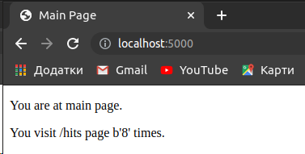
   - Ініціалізував середовище для тестів у іншій вкладці шелу та запустив їх командою `pipenv run 
     pytest test_app.py --url http://localhost:5000`.
      Деякі тести виконались успішно а деякі провалились, створив папку `logs` а в ній файл `app.log`,
     після чого всі тести виконались успішно.  
      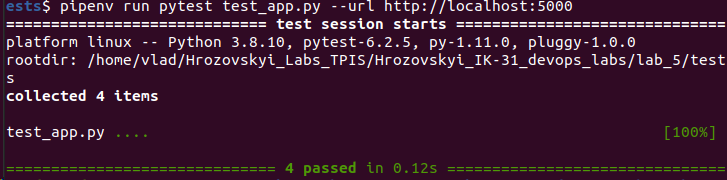
   - Перевірив роботусайту перейшоши на інші сторінки:  
      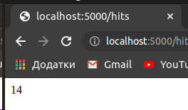
      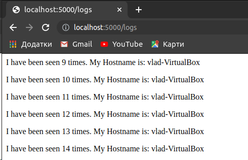
   - Видалив всі файли що створилися під час запуску середовищ.
6. Створив два `Dockerfile` з іменами як у репозиторії викладача та `Makefile` який допоможе 
   автоматизувати процес розгортання;
7. Ознайомився із вмістом `Dockerfile` та `Makefile` та його директивами.  
    Директиви `Makefile`:  
    - `STATES` - змінна з назвами тегів;
    - `REPO` - змінна яка містить назву Docker Hub репозиторію відповідно;
    - `.PHONY` - утиліта make, яка вказує файлу, що переліченні нище цілі не являються файлами;
    - `$(STATES)` - директива для білда контейнера;
    - `run`  -  ціль, призначення для створення мережі, у якій буде працювати додаток; запуску 
      додатку і сховища redis;
    - `test-app` - ціль для запуску тестів;
    - `docker-prune` - видалення контейнерів, волюмів, мереж та імеджів.
8. Створив Docker імеджі для додатку та для тестів командою `make .PHONY`;
9. Запустив сайт та тести:
   ```
   make run
   make test-app
   ```
   - Перевірив роботу всіх сторінок  
      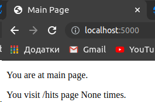
      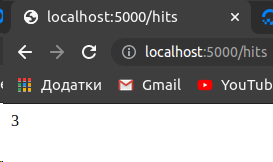
      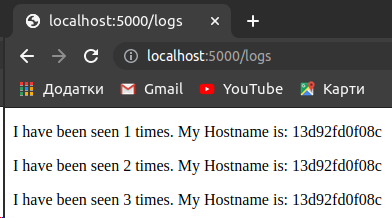
   - Перевірив виконання тестів  
      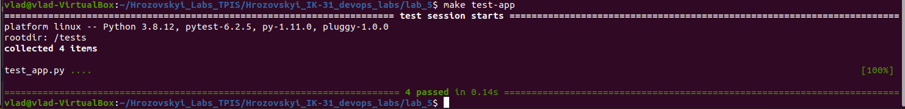
10. Зупинив проект натиснувши `Ctrl+C` та почистив всі ресурси `Docker` за допомогою `make docker-prune`.
11. Створив директиву `push` в `Makefile` для завантаження створених імеджів у Docker Hub репозиторій.  
    Завантажив імеджі до репозиторію `vladgrz/lab_5`;
12. Видалив створені та закачені імеджі. Після чого команда `docker images` вивела пусті рядки. 
    Створив директиву `delete-images` в `Makefile` для автоматизації процесу видалення імеджів.  
   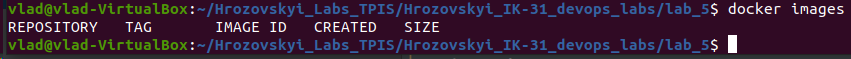
13. Cтворив файл `docker-compose.yaml` у кореновій папці проекту та заповнив вмістом з прикладу. У 
    мережі `secret` знаходиться `app` і `redis`, а у `public` - `app` і `tests`, таким чином `tests` 
    i `redis` не мають доступу один до одного.
14. Перевірив чи `Docker-compose` встановлений та працює у моїй системі, а далі просто запустив 
    `docker-compose`;
```
docker-compose version
docker-compose version 1.25.5, build unknown
docker-py version: 4.4.4
CPython version: 3.6.9
OpenSSL version: OpenSSL 1.1.1  11 Sep 2018
docker-compose -p lab_5 up
```
15. Перехожу на адресу `http://127.0.0.1/` та бачу, що сайт працює.  
   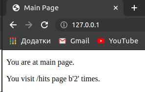
16. Перевірив чи компоуз створив докер імеджі. Імеджі мають назви `compose-tests` і `compose-app`. 
    Змінюю їх на власний репозиторій `vladgrz/lab_5` і перезапускаю `docker-compose`, 
    очистивше імеджі без тегів за допомогою директиви в Makefile, яку я створив раніше:  
    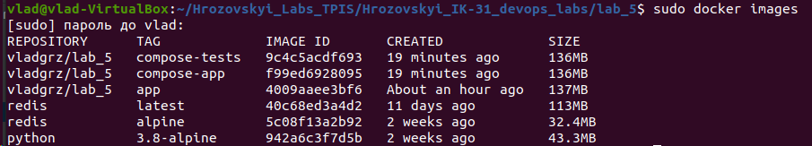
17. Зупинив проект, натиснувши Ctrl+C, і очистив ресурси створені компоуз `docker-compose down`.
18. Завантажив створені імеджі до Docker Hub [репозиторію](https://hub.docker.com/repository/docker/vladgrz/lab_5) за допомого команди:
   ```
   docker-compose push
   ```
19. На мою думку, кращим є варіант з використанням `docker-compose.yaml`. `Makefile` є громіздким і 
    потребує довгого налаштування, в свою чергукомпоуз значно швидше налаштувати і якщо навіть буде 
    більше контейнерів то багато роботи це не додасть, прості команди та налаштування в одному файлі 
    роблятьвикористання компоузу значно легшим та швидшим.
20. Створив `docker-compose.yaml` для лабораторної №4.
21. Командою `docker-compose -p lab4 up` запустив сайт.
22. Переходжу за адресою `http://127.0.0.1:8000/` та бачу, що сайт працює.
    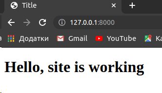
23. Моніторинг теж працює, в файлі `server.log` з'явились логи сайту.
24. Зупинив проект та завантажив імеджі в `Docker Hub` [репозиторій](https://hub.docker.com/repository/docker/vladgrz/lab_4):
```
docker-compose push
```