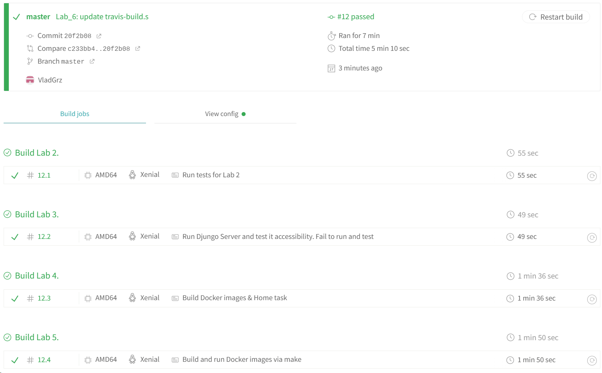

# Lab_6: Автоматизація за допомогою CI/CD серверів.

****

## Хід роботи:
1. Перейшов на [стартову сторінку](https://docs.travis-ci.com/user/tutorial/) та ознайомився як 
   налаштувати інтеграцію з GitHub та додати репозиторій;
2. На дашборді відобразились всі мої репозиторії. Додав свій репозиторій до Travis.  

3. Для того щоб Travis знав які кроки потрібно виконати над кодом у кореневій папці даного 
   репозиторію створив файл .travis.yml. Вніс в нього вміст з ткого ж файлу з ропозиторію викладача, 
   після чого змінив деякі дані на свої.
4. Щоб врахувати попередні лабораторні роботи змінюю вміст файлу:
    - переписав білд lab_2 з використання кроків записаних у Makefile;
    - переписав білд lab_4 де я створював ще один DockerFile для контейнера моніторингу;
    - переписав білд lab_5 і додав кроки Makefile які робили push імеджів у Docker Hub репозиторій;
    - залишив [посилання](https://app.travis-ci.com/github/VladGrz/Hrozovskyi_IK-31_devops_labs) на тревіс.
5. Закомітив файл .travis.yml та перейшовши на тревіс побачив, що білд виконався успішно.  
